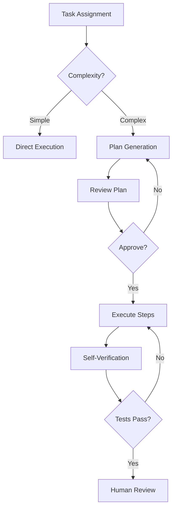

# 🚀 Comet Excellence Prompts

> **Anti-SLOP Knowledge Base**: Curated AI agent prompts, best practices, and performance optimization strategies for maximum output quality with minimal token consumption.

[](https://opensource.org/licenses/MIT)
[](https://github.com/shiimera-glitch/comet-excellence-prompts/graphs/commit-activity)

## 📋 Table of Contents

- [Philosophy](#philosophy)
- [Core Principles](#core-principles)
- [Prompt Engineering Best Practices](#prompt-engineering-best-practices)
- [Workflow Optimization](#workflow-optimization)
- [Quality Framework](#quality-framework)
- [Curated Prompts Library](#curated-prompts-library)
- [Token Optimization Strategies](#token-optimization-strategies)
- [Resources](#resources)

---

## 🎯 Philosophy

**Excellence over Expedience. Precision over Prolixity. Verifiable over Vague.**

This repository exists to combat **SLOP** (Shoddy, Lazy, Overly-wordy, Predictable) AI outputs by providing:

1. **Structured prompts** that enforce quality standards
2. **Workflows** that optimize AI agent performance
3. **Verification frameworks** ensuring output reliability
4. **Token-efficient strategies** reducing costs without sacrificing quality

### What This Is NOT

❌ Generic prompt collections
❌ Unverified community suggestions
❌ One-size-fits-all templates
❌ Verbose, token-wasting approaches

### What This IS

✅ Battle-tested prompts from real production use
✅ Evidence-based optimization techniques
✅ Domain-specific workflows (coding, documentation, analysis)
✅ Measurable quality improvements

---

## 🧠 Core Principles

Based on research from [VS Code AI Best Practices](https://code.visualstudio.com/docs/agents/best-practices)[web:10], [GitHub Copilot Production Guidelines](https://github.blog/ai-and-ml/github-copilot/github-copilot-coding-agent-101-getting-started-with-agentic-workflows-on-github/)[web:13], and [LLM Optimization Studies](https://latitude.so/blog/5-ways-to-optimize-llm-prompts-for-production-environments)[web:8].

### 1. **Specificity Over Ambiguity**

```markdown
❌ BAD: "Make this better"
✅ GOOD: "Reduce time complexity from O(n²) to O(n log n) using a heap-based approach"
```

### 2. **Structured Input/Output**

```markdown
✅ Define clear formats (JSON, Markdown tables, code blocks)
✅ Specify constraints explicitly
✅ Provide example inputs/outputs
```

### 3. **Decomposition**

```markdown
✅ Break complex tasks into smaller, scoped steps
✅ One responsibility per prompt
✅ Chain prompts with clear handoffs
```

### 4. **Verification Built-In**

```markdown
✅ Include test cases in prompts
✅ Request self-verification
✅ Specify acceptance criteria
```

### 5. **Context Efficiency**

```markdown
✅ Reference files with `#file` syntax
✅ Use fresh sessions for unrelated tasks
✅ Prune irrelevant context
```

---

## 📝 Prompt Engineering Best Practices

### Template Structure

```markdown
## Task
[Clear, specific objective]

## Context
[Relevant background, constraints, tech stack]

## Input
[Example or actual input data]

## Expected Output
[Format, structure, success criteria]

## Constraints
- Must use [specific technology/pattern]
- Performance target: [metric]
- Code style: [standard]

## Verification
- [ ] Test case 1 passes
- [ ] No ESLint errors
- [ ] Coverage > 80%
```

### Examples from Production

#### Code Review Prompt

```markdown
## Task
Review the following pull request changes for security vulnerabilities, performance issues, and code quality.

## Context
- Repository: telegram-web-translator-pro
- Tech stack: JavaScript, ESLint, userscript
- Focus: IIFE pattern, linting configuration

## Review Criteria
1. **Security**: Check for XSS, injection vulnerabilities
2. **Performance**: Identify O(n²) algorithms, unnecessary re-renders
3. **Maintainability**: Assess code clarity, naming conventions
4. **Standards Compliance**: ESLint rules, project conventions

## Output Format
Markdown with:
- ❌ Critical issues (blocking)
- ⚠️ Warnings (should fix)
- ℹ️ Suggestions (nice-to-have)
- ✅ Approvals (explicitly state what's good)

## Verification
- All critical issues must have fix recommendations
- Include code examples for suggested changes
```

#### Documentation Generation Prompt

```markdown
## Task
Generate comprehensive README documentation for the comet-agent-loop project.

## Context
- **Project**: Tampermonkey userscript for AI agent persistence
- **Audience**: Developers using Perplexity/Comet AI agents
- **Goal**: Reduce setup friction, explain architecture

## Required Sections
1. Installation (copy-paste ready)
2. Features (with visual examples)
3. Configuration (all options documented)
4. Architecture (mermaid diagram)
5. Troubleshooting (common issues)
6. Contributing guidelines

## Quality Standards
- All code blocks must be syntax-highlighted
- Include shields.io badges for status
- No marketing fluff, technical clarity only
- Examples must be runnable

## Output Format
- Markdown with proper heading hierarchy
- Mermaid diagrams for architecture
- Code fences with language tags

## Verification
- [ ] All sections present
- [ ] No broken internal links
- [ ] Code examples are valid
- [ ] No placeholder text ("TODO", "TBD")
```

---

## ⚙️ Workflow Optimization

### Agent Workflow Pattern



### Best Practices from GitHub Copilot Production Use[web:7]

1. **AI as Junior Engineer (with superspeed)**
   - AI opens **draft PRs only**
   - No direct pushes to `main`, `release`, protected branches
   - Every AI PR tagged with `ai-generated` label

2. **Minimum CI Stack**
   - Unit + integration tests (coverage thresholds enforced)
   - Static analysis (ESLint, Ruff, golangci-lint)
   - Security scanning (CodeQL, SAST)
   - Dependency scanning (Dependabot, Snyk)
   - Formatting gates (zero diff allowed)

3. **Security Mandates**
   - Run CodeQL on **every AI PR**
   - Explicitly scan: auth logic, input validation, secrets handling
   - **Never** allow AI to: roll its own crypto, design auth flows unsupervised, modify security-critical modules without senior review

4. **Agent Specialization**
   - **Agent A**: Scaffolding
   - **Agent B**: Test generation
   - **Agent C**: Refactoring
   - Shared context via: ADRs, architecture docs, code ownership rules

5. **Code Quality Preferences**
   - Enforce: small functions, shallow abstractions, clear naming over DRY obsession
   - Reject: meta-programming (unless justified), "frameworks inside frameworks"

---

## ✅ Quality Framework

### Output Verification Checklist

```markdown
- [ ] **Accuracy**: Facts are verifiable, no hallucinations
- [ ] **Completeness**: All requirements addressed
- [ ] **Efficiency**: Optimal approach, no obvious inefficiencies
- [ ] **Standards Compliance**: Follows project conventions
- [ ] **Maintainability**: Code is clear, documented, testable
- [ ] **Security**: No vulnerabilities introduced
- [ ] **Performance**: Meets defined metrics
- [ ] **Documentation**: Changes are documented
```

### Token Efficiency Metrics

| Metric | Target | Measurement |
|--------|--------|-------------|
| **Prompt Clarity** | < 200 tokens | Concise, specific instructions |
| **Context Relevance** | > 80% | Relevant files/info only |
| **Output Precision** | < 500 tokens | No unnecessary verbosity |
| **Iteration Count** | < 3 rounds | Get it right early |

---

## 📚 Curated Prompts Library

### Category: Code Generation

#### 1. ESLint Configuration Migration

```markdown
## Task
Migrate ESLint configuration from v8 (eslintrc) to v10 (flat config).

## Context
- Current: `.eslintrc.json`, `.eslintignore`
- Target: `eslint.config.js` (flat config)
- Repository: telegram-web-translator-pro

## Requirements
1. Convert all rules from eslintrc to flat config
2. Migrate ignore patterns from `.eslintignore` to config
3. Ensure backward compatibility with existing CI
4. Add comments explaining major changes

## Output
- Complete `eslint.config.js` file
- Migration guide (what changed, why)
- Testing steps

## Verification
- [ ] `npm run lint` passes
- [ ] All previous rules are preserved
- [ ] Ignore patterns work correctly
```

### Category: Documentation

#### 2. Technical Decision Record (ADR)

```markdown
## Task
Generate an Architecture Decision Record for [DECISION].

## Format (ADR Template)
### Context
[What is the issue we're addressing?]

### Decision
[What did we decide?]

### Consequences
**Positive:**
- [Benefit 1]

**Negative:**
- [Tradeoff 1]

**Neutral:**
- [Impact 1]

### Alternatives Considered
1. [Option A] - Rejected because [reason]
2. [Option B] - Rejected because [reason]

### References
- [Link to relevant discussion]
- [Link to implementation PR]

## Output Format
Markdown file: `docs/adr/NNNN-decision-title.md`

## Verification
- [ ] Clearly explains "why"
- [ ] Lists alternatives
- [ ] Includes consequences
```

### Category: Code Review

#### 3. Security-Focused PR Review

```markdown
## Task
Perform security audit on PR changes.

## Security Checklist
- [ ] **Input Validation**: All user inputs sanitized?
- [ ] **Output Encoding**: XSS prevention in place?
- [ ] **Authentication**: Auth checks present and correct?
- [ ] **Authorization**: Proper permission checks?
- [ ] **Secrets**: No hardcoded credentials?
- [ ] **Dependencies**: No vulnerable packages?
- [ ] **Crypto**: Using standard libraries (not custom)?
- [ ] **Injection**: SQL/command injection prevented?

## Output Format
### 🔴 Critical (Must Fix)
- [Issue]: [Description]
- **Risk**: [Explanation]
- **Fix**: [Code example]

### 🟡 Medium (Should Fix)
- [Issue]: [Description]

### ✅ Passed
- [Check]: [Confirmation]

## Verification
- [ ] All critical issues have actionable fixes
- [ ] Risk levels are justified
```

---

## 🎛️ Token Optimization Strategies

Based on [Latitude LLM Optimization Guide](https://latitude.so/blog/5-ways-to-optimize-llm-prompts-for-production-environments)[web:8].

### 1. Prompt Compression

```markdown
❌ VERBOSE (124 tokens):
"I need you to please analyze the following code carefully and thoroughly, 
looking for any potential issues, bugs, or areas where the code quality 
could be improved. Please be comprehensive in your analysis and don't 
miss anything important."

✅ COMPRESSED (18 tokens):
"Analyze code for:
- Bugs
- Performance issues  
- Code quality improvements

Be comprehensive."
```

### 2. Context Scoping

```markdown
✅ GOOD: Reference specific files
#src/21-footer.js #src/00-header.js
"Why do these files need ESLint ignore?"

❌ BAD: Generic context dump
"Here's the entire codebase... [15,000 tokens]"
```

### 3. Few-Shot Over Zero-Shot

```markdown
✅ Include 1-2 examples in prompt:

## Example Input
```js
function slow(arr) {
  for (let i = 0; i < arr.length; i++) {
    for (let j = 0; j < arr.length; j++) {
      // ...
    }
  }
}
```

## Example Output
```js
// O(n²) → O(n) using hash map
function fast(arr) {
  const seen = new Set();
  for (const item of arr) {
    if (!seen.has(item)) {
      seen.add(item);
      // ...
    }
  }
}
```
```

### 4. Session Hygiene

```markdown
✅ DO:
- Start fresh session for unrelated tasks
- Clear context when switching domains
- Use persistent context files (e.g., ARCHITECTURE.md)

❌ DON'T:
- Pile 10 unrelated questions in one conversation
- Let context bloat to 50,000 tokens
- Mix debugging + feature requests + docs in one session
```

### 5. Structured Outputs

```markdown
✅ Request structured formats:
"Output as JSON:"
{
  "issues": [...],
  "severity": "high|medium|low",
  "recommendation": "..."
}

Benefits:
- Easier to parse
- No ambiguous natural language
- Token-efficient
```

---

## 🔗 Resources

### Essential Reading

1. **[VS Code AI Best Practices](https://code.visualstudio.com/docs/agents/best-practices)** - Official AI agent guidelines[web:10]
2. **[GitHub Copilot Production Workflows](https://github.blog/ai-and-ml/github-copilot/github-copilot-coding-agent-101-getting-started-with-agentic-workflows-on-github/)** - Agentic workflow patterns[web:13]
3. **[LLM Prompt Optimization (Latitude)](https://latitude.so/blog/5-ways-to-optimize-llm-prompts-for-production-environments)** - Production optimization techniques[web:8]
4. **[GitHub Production Best Practices](https://github.com/orgs/community/discussions/182197)** - Real-world AI agent deployment[web:7]

### Curated Repositories

- **[Awesome Prompt Engineering](https://github.com/promptslab/awesome-prompt-engineering)** - Comprehensive prompt engineering resources[web:3]
- **[Awesome AI Coding Prompts](https://github.com/convertscout/awesome-ai-prompts)** - 500+ Cursor rules and coding prompts[web:6]
- **[GitHub Awesome Copilot](https://github.com/github/awesome-copilot)** - Official Copilot agents, skills, instructions[web:4]

### Related Projects

- **[comet-agent-loop](https://github.com/shiimera-glitch/comet-agent-loop)** - Tampermonkey userscript for AI agent persistence
- **[telegram-web-translator-pro](https://github.com/shiimera-glitch/telegram-web-translator-pro)** - Production example with CI/CD integration

---

## 🤝 Contributing

Contributions welcome! Criteria for inclusion:

✅ **Battle-tested** in real projects
✅ **Measurable improvement** over baseline
✅ **Well-documented** with examples
✅ **Domain-specific** (not generic advice)

---

## 📜 License

MIT License - see [LICENSE](LICENSE) for details.

---

## 🔄 Changelog

### 2026-07-01 - Initial Release
- Core principles documentation
- Curated prompts library (3 categories)
- Token optimization strategies
- Quality framework
- Resource compilation from latest 2026 research

---

**Built with ❤️ for AI excellence. Zero SLOP tolerance.**
